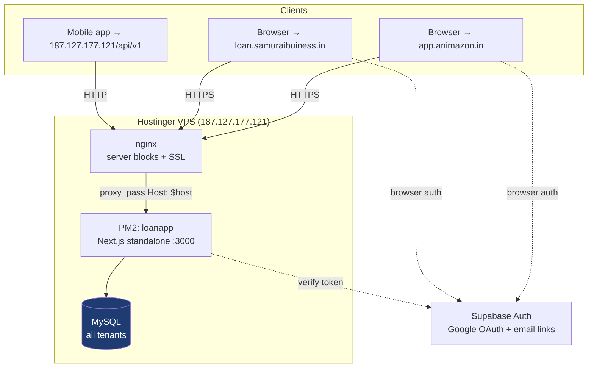
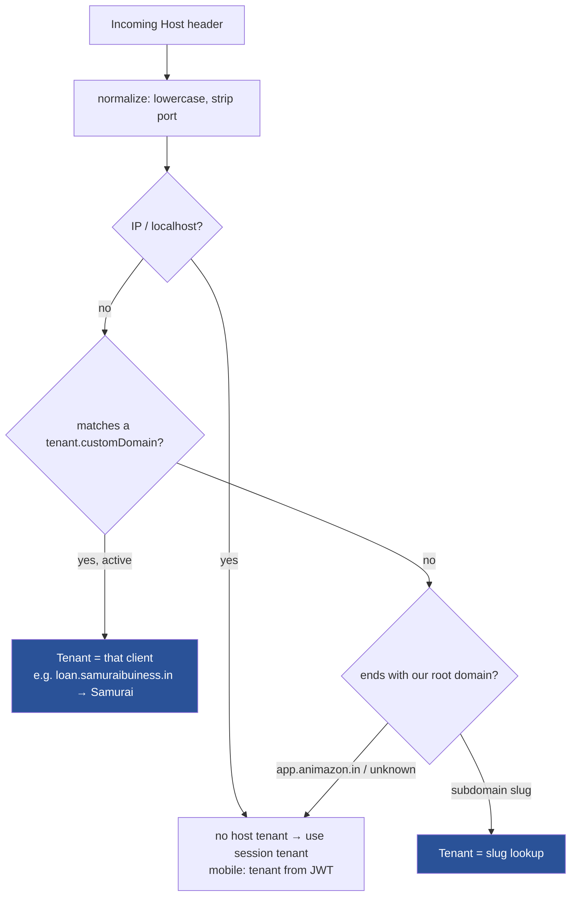
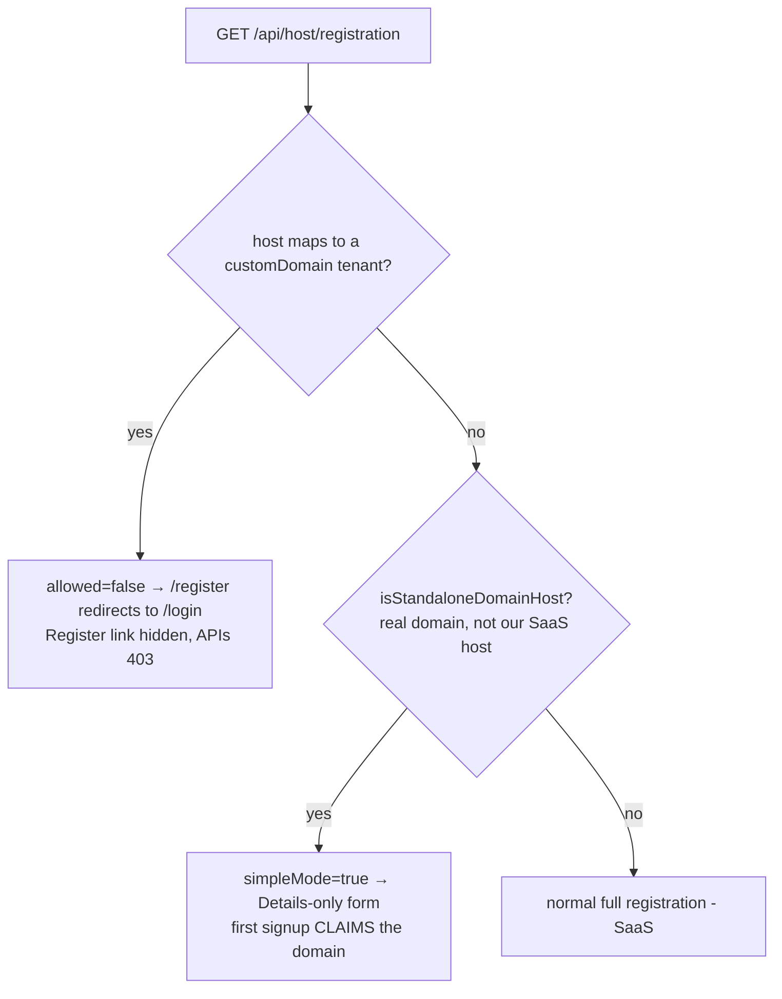
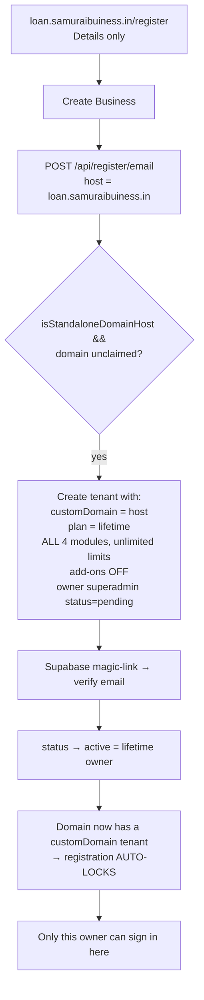
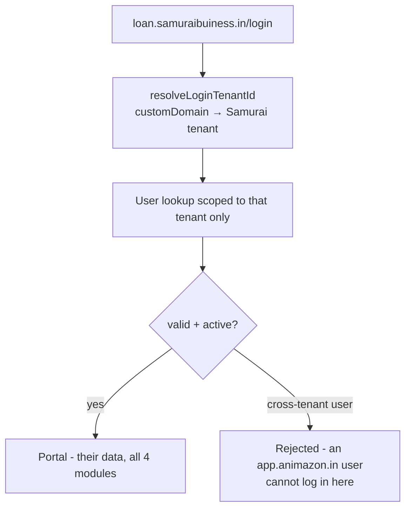
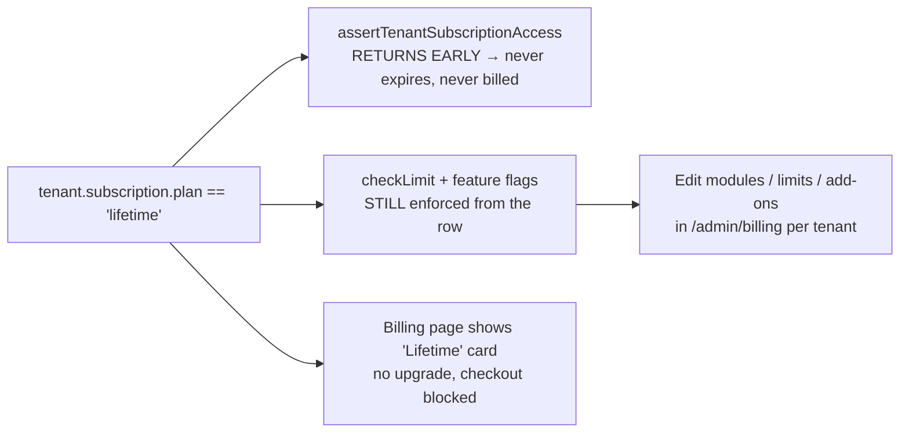
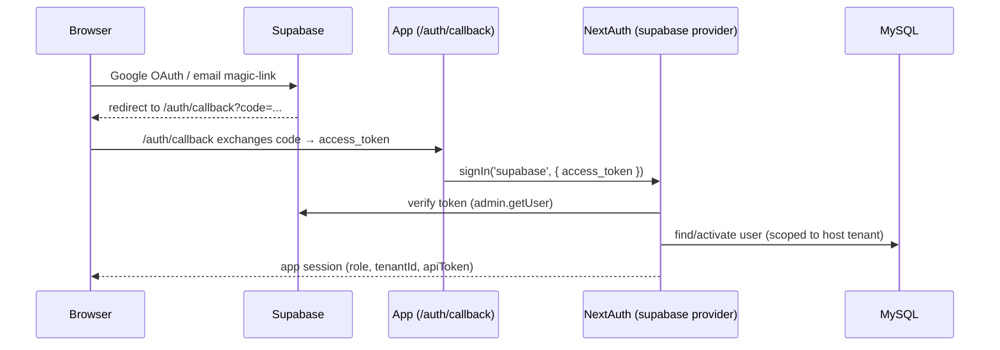

# LoanTrack — Two-Domain Architecture (SaaS + Standalone Client)

> One codebase + one MySQL database serves **two products** that differ only by
> **host** and per-tenant **license**:
>
> | | Host | Model | Registration |
> |---|---|---|---|
> | **Our SaaS** | `app.animazon.in` | Multi-tenant, paid subscription | Full 5-step, anyone |
> | **Client standalone** | `loan.samuraibuiness.in` | Single tenant, **lifetime** (no billing) | Details-only, **first signup claims + locks** |
>
> Mobile API for both is served over HTTP on the IP `187.127.177.121` (JWT carries the tenant).

---

## 1. High-level architecture



**Key idea:** nginx forwards the original `Host` header. The app resolves *which
tenant* from that host. Same process, same DB — behaviour forks on host + license.

---

## 2. Host → Tenant resolution (the core fork)

Every request resolves a tenant from the `Host` header. Custom domain is checked
**before** the subdomain logic, so a reserved first label (e.g. `loan.*`) can't
shadow it.



- Code: `getTenantIdFromHost()` and `getCustomDomainTenantId()` in `lib/tenant.ts`;
  login path mirrors this in `resolveLoginTenantId()` (`lib/auth.ts`).
- `NEXT_PUBLIC_ROOT_DOMAIN` is **empty** in prod → cookies stay **host-only**, so a
  session on `loan.samuraibuiness.in` is never sent to `app.animazon.in`.

---

## 3. SaaS domain — `app.animazon.in`

### 3.1 Registration (full, multi-tenant)

```mermaid
flowchart TD
    R0[/register] --> R1[Step 1: Details<br/>business, owner, phone, email, username, password]
    R1 --> R2[Step 2: Verticals/modules]
    R2 --> R3[Step 3: Plan<br/>free / basic / business / enterprise]
    R3 --> R4[Step 4: Add-ons]
    R4 --> R5[Step 5: Review + Terms]
    R5 --> API[POST /api/register/email]
    API --> NT[Create NEW tenant + HQ branch<br/>+ subscription from plan catalog<br/>+ owner superadmin status=pending]
    NT --> V[Supabase magic-link → verify email]
    V --> ACT[status pending → active]
    ACT --> LOGIN[Login → portal]
```

### 3.2 Login (subscription enforced)

```mermaid
flowchart TD
    L0[/login] --> L1{method}
    L1 -->|username + password| C[NextAuth Credentials<br/>MySQL bcrypt]
    L1 -->|Continue with Google| G[Supabase OAuth → /auth/callback<br/>→ signIn 'supabase']
    C --> S[Session: role, tenantId, apiToken]
    G --> S
    S --> GATE{assertTenantSubscriptionAccess}
    GATE -->|active| P[Portal / module dashboards]
    GATE -->|trial/period expired| BLK[Blocked → billing/upgrade]
```

- Subscription gates live in `lib/subscription.ts`
  (`assertTenantSubscriptionAccess`, `checkLimit`) and are called from
  `getCurrentTenantId()` (`lib/tenant.ts`).

### 3.3 Developer "Open account" (no-login tenant access)

Replaces the old "Monitor Mode". A developer enters any tenant without logging in;
a sticky banner shows which account.

```mermaid
flowchart TD
    D0[Developer @ /admin/users] --> D1[Click 'Open' on a client]
    D1 --> D2[POST /api/developer/monitor<br/>sets monitor-token cookie]
    D2 --> D3[Session impersonates that tenant's superadmin<br/>middleware routes as superadmin]
    D3 --> BAN[Sticky banner:<br/>'You are inside &lt;Business Name&gt; (developer view)']
    BAN --> OPS[Browse / operate the tenant]
    OPS --> EX[Exit to Admin → /api/developer/monitor/exit<br/>clears cookie → app.animazon.in/admin/users]
```

- Banner: `components/MonitorBanner.tsx` (shows `tenant.name`).
- Exit redirect uses `APP_URL` (not the internal `localhost:3000`).

---

## 4. Client standalone domain — `loan.samuraibuiness.in`

### 4.1 Registration policy per host



### 4.2 Self-claim signup (Details-only → lifetime owner → lock)



> After the claim, `/api/host/registration` returns `allowed=false` for that host —
> no second business / superadmin can ever self-register. Extra owners are added
> **in-app only** (see §6).

### 4.3 Login (scoped to the one tenant)



---

## 5. Lifetime license model (time-only)



- "Lifetime" = unlimited **time** only. Features, modules and limits remain
  controlled per-tenant in the admin billing panel (`lib/subscription.ts`,
  `lib/plans.ts`).

---

## 6. Multiple owners (co-owner), in-app only

```mermaid
flowchart TD
    O0[Superadmin @ /admin/users → New User] --> O1[Role = 'Co-Owner (Super Admin)']
    O1 --> O2[manageMasterUser]
    O2 --> O3{actor is developer?}
    O3 -->|developer + superadmin role| NEWB[Create NEW tenant - onboarding a business]
    O3 -->|superadmin + superadmin role| CO[CO-OWNER in the SAME account<br/>linked to all its branches<br/>no new tenant]
```

Created **inside the app** only — never via public registration (blocked on client
domains). Logic in `manageMasterUser` (`app/admin/actions.ts`).

---

## 7. Supabase auth bridge (both domains)

Supabase is an **auth broker** only (Google OAuth + email magic-link). MySQL keeps
users/passwords; NextAuth issues the session.



- Browser ↔ Supabase calls require the Supabase origin in the app's CSP
  `connect-src` (`next.config.ts`) and the domain in Supabase's redirect allowlist.

---

## 8. Infra & config reference

| Concern | SaaS (`app.animazon.in`) | Client (`loan.samuraibuiness.in`) |
|---|---|---|
| nginx | `server_name app.animazon.in` (default_server) | `server_name loan.samuraibuiness.in` (samurai.conf) |
| SSL | certbot | certbot (separate cert) |
| DNS | A → 187.127.177.121 | A → 187.127.177.121 |
| Tenant resolution | subdomain/slug or session | `tenant.customDomain` exact match |
| Registration | full, all plans | Details-only, claims lifetime, then locked |
| Cookie domain | host-only (ROOT_DOMAIN empty) | host-only |
| Supabase allowlist | `https://app.animazon.in/**` | `https://loan.samuraibuiness.in/**` |
| CORS (`CORS_EXTRA_ORIGINS`) | n/a (same-origin) | `https://loan.samuraibuiness.in` |

### Key files
- Tenant/host: `lib/tenant.ts` (`getTenantIdFromHost`, `getCustomDomainTenantId`, `isStandaloneDomainHost`)
- Auth/session: `lib/auth.ts` (`resolveLoginTenantId`, supabase provider, apiToken refresh, monitor session)
- Subscription/lifetime: `lib/subscription.ts`, `lib/plans.ts`
- Registration: `app/register/page.tsx`, `app/api/register/email|google/route.ts`, `app/api/host/registration/route.ts`
- Supabase: `lib/supabase/{server,browser}.ts`, `app/auth/callback/page.tsx`
- Developer access: `app/admin/users/UsersClient.tsx`, `app/api/developer/monitor/*`, `components/MonitorBanner.tsx`

### Onboarding a NEW standalone client (checklist)
1. Client buys domain → add DNS **A record** `→ 187.127.177.121`.
2. Add nginx `server` block for the host → `certbot --nginx -d <host>`.
3. Add `<host>` to Supabase redirect allowlist + `CORS_EXTRA_ORIGINS`.
4. Client visits `https://<host>/register` → Details-only → first signup **auto-claims** lifetime + all modules + locks.
5. Tune modules/limits/add-ons in `/admin/billing` if needed.
