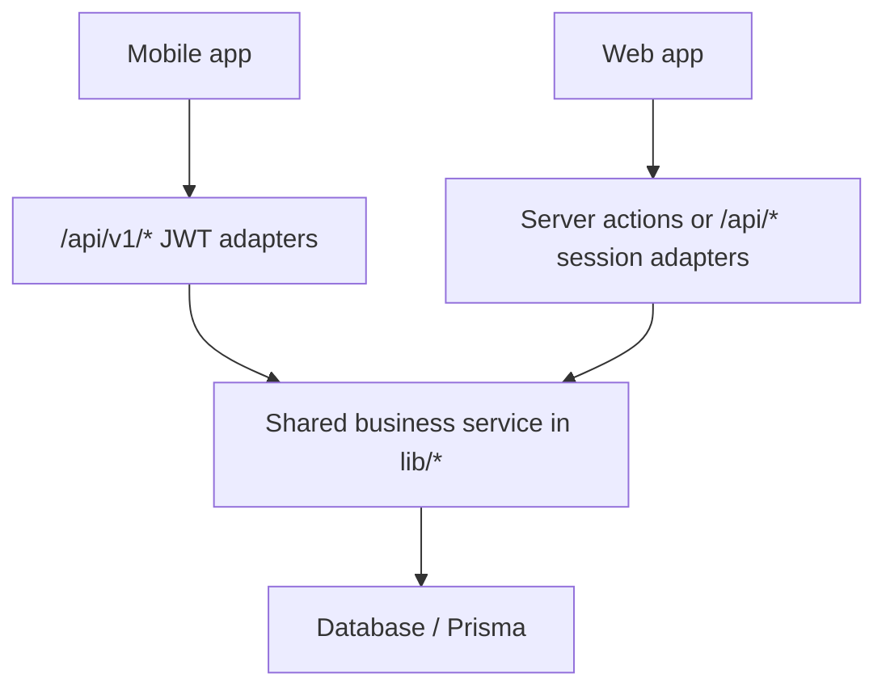

# Mobile vs Desktop Feature Parity

Status legend: Full = usable on both desktop and mobile. Partial = mobile has a safe path but less depth than desktop. Missing = no mobile-safe implementation yet. Web-only = intentionally browser/session-only. System-only = not a user mobile target.

| Feature/module | Desktop source | Mobile v1 API | Flutter route/screen | Shared service | Roles | Before | After | Fix needed |
| --- | --- | --- | --- | --- | --- | --- | --- | --- |
| NPA summary, loans, history, upgrade | `/api/npa/*`, desktop NPA routes | `/api/v1/npa/*` | `/npa`, `NpaScreen`; `/settings/npa` remains config | `lib/npa/npaService.ts` | admin, superadmin | Missing | Full | Keep agents blocked; expand filters if product asks |
| Basic accounting summary | `/accounting` module | `/api/v1/accounting` | `/accounting` dashboard | Existing accounting queries | admin, superadmin, developer | Full | Full | None |
| Premium CoA | premium accounting CoA page/actions | `/api/v1/accounting/coa` | `/accounting` CoA view | Existing v1/accounting service logic | admin, superadmin, developer | Full | Full | Move duplicated route logic into shared service later |
| Premium journal | premium journal pages/actions | `/api/v1/accounting/journal/*` | `/accounting` journal view | Existing v1/accounting service logic | admin, superadmin, developer | Partial | Partial | Add dedicated mobile journal detail/new-entry depth |
| Premium statements | P&L, balance sheet, trial balance pages | `/api/v1/accounting/pnl`, `/balance-sheet`, `/trial-balance`, `/statements` | `/accounting` statements view | `lib/accounting/queries.ts` | admin, superadmin, developer | Full | Full | None |
| Bank reconciliation | premium bank-rec pages/actions | `/api/v1/accounting/bank-rec` | `/accounting/bank-rec` | Existing v1/accounting service logic | admin, superadmin, developer | Full | Full | None |
| Period locks | premium period-lock pages/actions | `/api/v1/accounting/periods` | `/accounting` periods view | Existing v1/accounting service logic | admin, superadmin, developer | Full | Full | None |
| Cashflow | premium cashflow page/actions | `/api/v1/accounting/cashflow` | `/accounting` cashflow view | `lib/accounting/premiumMobileService.ts` | admin, superadmin, developer | Missing | Full | None |
| Accounting approvals | premium approvals page/actions | `/api/v1/accounting/approvals` | `/accounting` approvals view | `lib/accounting/premiumMobileService.ts` | admin, superadmin, developer | Missing | Partial | Add mobile approve/reject controls after UX review |
| Budget | premium budget page/actions | `/api/v1/accounting/budget` | `/accounting` budget view | `lib/accounting/premiumMobileService.ts` | admin, superadmin, developer | Missing | Partial | Add create/edit/approve budget actions |
| Tax & GST | premium tax page/actions | `/api/v1/accounting/tax` | `/accounting` tax view | `lib/accounting/premiumMobileService.ts` | admin, superadmin, developer | Missing | Partial | Add recompute/file/challan mobile actions if required |
| Vendors/AP bills | premium vendors page/actions | `/api/v1/accounting/vendors` | `/accounting` vendors view | `lib/accounting/premiumMobileService.ts` | admin, superadmin, developer | Missing | Partial | Add vendor and bill CRUD/pay/post flows |
| Accounting export | premium export page/actions | `/api/v1/accounting/export` | `/accounting` export-runs view | `lib/accounting/premiumMobileService.ts` | superadmin, developer for generation | Missing | Partial | Generation/download stays web-oriented; mobile shows run history |
| Premium settings | premium settings page/actions | `/api/v1/accounting/settings` | `/accounting` settings view | `lib/accounting/premiumMobileService.ts` | admin, superadmin, developer | Missing | Partial | Add edit settings for superadmin/developer |
| Settings | desktop settings tabs | `/api/v1/settings`, packages/payment routes | `/settings/*` | Mixed settings services | admin, superadmin, developer | Partial | Partial | Audit each tab for write support |
| Reports/analytics | reports and analytics pages | `/api/v1/reports/*`, `/analytics/*` | `/reports`, `/analytics` | Existing report services | admin, superadmin, developer | Partial | Partial | Add export/download parity only if mobile needs it |
| KYC | KYC review and provider flows | `/api/v1/kyc/queue`, `/review` | `/kyc-review` | KYC service modules | admin, superadmin, developer | Partial | Partial | Aadhaar/video initiation remains to audit |
| Chits | desktop chits create/edit/detail/auctions | `/api/v1/chits/*` | `/chits` | Existing v1 chits routes | subscribed users | Partial | Partial | Add mobile create/edit/member/auction depth |
| Admin/developer | admin users, branches, billing, pricing, affiliates, requests | `/api/v1/admin/*`, pricing/packages | `/admin/*`, `/portal/*`, `/microlending/*` | Existing admin services | developer, superadmin, admin | Partial | Partial | Audit action-level parity |
| Notifications | notification center/log | `/api/v1/notifications` | `/notifications` | Existing notification services | authenticated | Partial | Partial | Add log/action parity if needed |
| Vehicles | vehicle pages | `/api/v1/vehicles/*` | `/vehicles/*` | Existing vehicle services | subscribed users | Full | Full | None found in this audit |
| Wallet | wallet pages | `/api/v1/wallet/*` | `/wallet` | `lib/wallet.ts` | admin, superadmin, agent | Full | Full | None found in this audit |
| Penalties | penalties page/actions | `/api/v1/penalties/*` | `/penalties` | Existing penalty services | admin, superadmin, agent | Full | Full | None found in this audit |
| Approvals | general approvals page/actions | `/api/v1/approvals/*` | `/approvals` | Existing approval services | admin, superadmin, developer | Full | Full | None found in this audit |
| Collection | collection page, runs, self-pay | `/api/v1/collection/*` | `/collection`, `/collection/runs/*` | `lib/collectionWrite.ts`, `lib/collectionRun.ts`, `lib/selfPay.ts` | admin, superadmin, agent | Full | Full | None |
| Cron jobs | `/api/cron/*` | None | None | Cron/service modules | system | System-only | System-only | Not a mobile target |
| Webhooks | `/api/webhooks/*` | None | None | Webhook handlers | system | System-only | System-only | Not a mobile target |
| Borrower portal | `/borrower/*`, `/api/portal/*` | None | None | Borrower portal services | borrower | Web-only | Web-only | Separate product surface |
| Health/debug/files/backup/export internals | `/api/health`, `/api/debug`, files, backup | None | None | System helpers | system/developer | System-only | System-only | Not a mobile target |

## Architecture

## Notes

- Mobile must call only `/api/v1/*` user APIs.
- Non-v1 `/api/*` user routes remain web/session adapters.
- Feature gaps should be classified before implementation as Full, Partial, Missing, Web-only, or System-only.
- NPA is an add-on/feature area, not a product module in `types/modules.ts`.
