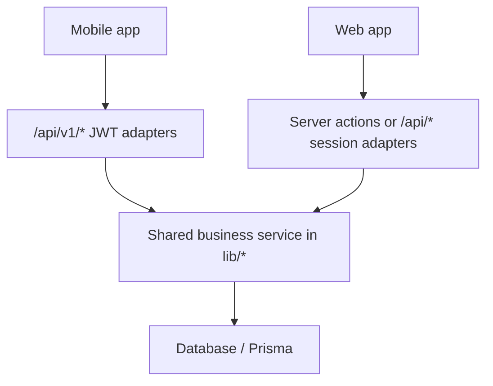

# Mobile vs Desktop Feature Parity

Status legend: Full = implemented on both surfaces. Partial = a functional or live-equivalence check remains. Missing = no mobile-safe implementation yet. Web-only = intentionally browser/session-only. System-only = not a user mobile target. This matrix records implementation status; it is not release certification.

| Feature/module | Desktop source | Mobile v1 API | Flutter route/screen | Shared service | Roles | Before | After | Fix needed |
| --- | --- | --- | --- | --- | --- | --- | --- | --- |
| Dashboard due and book KPIs | dashboard page | `/api/v1/dashboard` | `/dashboard` | `lib/dashboard/todayMetrics.ts`, `lib/dashboard/bookTotals.ts`, `lib/businessTime.ts` | admin, superadmin, developer | Partial | Partial | Due and book totals share code; remaining dashboard queries need live equivalence checks |
| Customer JSON import | Settings bulk tab | `/api/v1/import/customers` | Settings → Import customers | `lib/imports/customers.ts` | admin, superadmin, developer | Missing | Full | Requires active branch; web collection import is disabled and remains outside shipped parity |
| NPA summary, loans, history, upgrade | `/api/npa/*`, desktop NPA routes | `/api/v1/npa/*` | `/npa`, `NpaScreen`; `/settings/npa` remains config | `lib/npa/npaService.ts` | admin, superadmin | Missing | Full | Keep agents blocked; expand filters if product asks |
| Basic accounting summary | `/accounting` module | `/api/v1/accounting` | `/accounting` dashboard | Existing accounting queries | admin, superadmin, developer | Full | Full | None |
| Premium CoA | premium accounting CoA page/actions | `/api/v1/accounting/coa` | `/accounting` CoA view | Existing v1/accounting service logic | admin, superadmin, developer | Full | Full | Move duplicated route logic into shared service later |
| Premium journal | premium journal pages/actions | `/api/v1/accounting/journal/*` | `/accounting` journal view and entry form | `lib/accounting/journalInput.ts`, existing posting service | admin, superadmin, developer | Partial | Partial | Create, post, approve and reverse controls exist; live journal/balance equivalence test remains |
| Premium statements | P&L, balance sheet, trial balance pages | `/api/v1/accounting/pnl`, `/balance-sheet`, `/trial-balance`, `/statements` | `/accounting` statements view | `lib/accounting/queries.ts` | admin, superadmin, developer | Full | Full | None |
| Bank reconciliation | premium bank-rec pages/actions | `/api/v1/accounting/bank-rec` | `/accounting/bank-rec` | Existing v1/accounting service logic | admin, superadmin, developer | Full | Full | None |
| Period locks | premium period-lock pages/actions | `/api/v1/accounting/periods` | `/accounting` periods view | Existing v1/accounting service logic | admin, superadmin, developer | Full | Full | None |
| Cashflow | premium cashflow page/actions | `/api/v1/accounting/cashflow` | `/accounting` cashflow view | `lib/accounting/premiumMobileService.ts` | admin, superadmin, developer | Missing | Full | None |
| Accounting approvals | premium approvals page/actions | `/api/v1/accounting/approvals` | `/accounting` approvals view | `lib/accounting/premiumMobileService.ts` | admin, superadmin, developer | Missing | Partial | Review controls exist; live approval/GL equivalence test remains |
| Budget | premium budget page/actions | `/api/v1/accounting/budget` | `/accounting` budget view and detail | `lib/accounting/budgets.ts` | admin, superadmin, developer | Missing | Full | Create, edit, approve and archive now use shared operations |
| Tax & GST | premium tax page/actions | `/api/v1/accounting/tax` | `/accounting` tax view | `lib/accounting/tax.ts` | admin, superadmin, developer | Missing | Full | Recompute, file, TDS register and challan use shared operations |
| Vendors/AP bills | premium vendors page/actions | `/api/v1/accounting/vendors`, `/bills/*` | `/accounting` vendors and bills view | `lib/accounting/vendors.ts`, `bills.ts` | admin, superadmin, developer | Missing | Full | Vendor and bill create, edit, post, pay, cancel, and ageing are implemented |
| Accounting export | premium export page/actions | `/api/v1/accounting/export` | `/accounting` export view | `lib/accounting/exportService.ts` | superadmin, developer for generation | Missing | Full | Generation, sharing, history and Tally test/push use shared operations |
| Premium settings | premium settings page/actions | `/api/v1/accounting/settings` | `/accounting` settings view and form | `lib/accounting/settingsUpdate.ts` | superadmin, developer for writes | Missing | Full | Supported settings now editable on mobile |
| Settings | desktop settings tabs | `/api/v1/settings`, packages/payment routes | `/settings/*` | Mixed settings services | admin, superadmin, developer | Partial | Partial | Customer import, routes, packages, 2FA and notification templates work; remaining tab depth needs audit |
| Reports/analytics | reports and analytics pages | `/api/v1/reports/*`, `/analytics/*` | `/reports`, `/analytics` | Existing report services | admin, superadmin, developer | Partial | Partial | CSV/XLSX/PDF sharing exists; live report payload equivalence remains |
| KYC | KYC review and provider flows | `/api/v1/kyc/aadhaar-otp`, `/video`, `/queue`, `/review` | customer detail and `/kyc-review` | KYC service modules | admin, superadmin, developer | Partial | Partial | Aadhaar/video controls exist; provider-backed live flow remains unverified |
| Chits | desktop chits create/edit/detail/auctions | `/api/v1/chits/*` | `/chits` | Existing v1 chits routes | subscribed users | Partial | Partial | Add mobile create/edit/member/auction depth |
| Admin/developer | admin users, branches, billing, pricing, affiliates, requests | `/api/v1/admin/*`, pricing/packages | `/admin/*`, `/portal/*`, `/microlending/*` | Existing admin services | developer, superadmin, admin | Partial | Partial | Audit action-level parity |
| Notifications | notification center/log | `/api/v1/notifications`, `/log` | `/notifications`, Settings delivery log | Existing notification services | authenticated/admin for log | Partial | Full | Delivery states, filters and provider error display implemented |
| Vehicles | vehicle pages | `/api/v1/vehicles/*` | `/vehicles/*` | Existing vehicle services | subscribed users | Full | Full | None found in this audit |
| Wallet | wallet pages | `/api/v1/wallet/*` | `/wallet` | `lib/wallet.ts` | admin, superadmin, agent | Full | Full | None found in this audit |
| Penalties | penalties page/actions | `/api/v1/penalties/*` | `/penalties` | Existing penalty services | admin, superadmin, agent | Full | Full | None found in this audit |
| Approvals | general approvals page/actions | `/api/v1/approvals/*` | `/approvals` | Existing approval services | admin, superadmin, developer | Full | Full | None found in this audit |
| Collection | collection page, runs, self-pay | `/api/v1/collection/*` | `/collection`, `/collection/runs/*` | `lib/collectionWrite.ts`, `lib/collectionRun.ts`, `lib/selfPay.ts` | admin, superadmin, agent | Full | Full | None |
| Cron jobs | `/api/cron/*` | None | None | Cron/service modules | system | System-only | System-only | Not a mobile target |
| Webhooks | `/api/webhooks/*` | None | None | Webhook handlers | system | System-only | System-only | Not a mobile target |
| Borrower portal | `/borrower/*`, `/api/portal/*` | None | None | Borrower portal services | borrower | Web-only | Web-only | Separate product surface |
| Health/debug/files/backup/export internals | `/api/health`, `/api/debug`, files, backup | None | None | System helpers | system/developer | System-only | System-only | Not a mobile target |

## Architecture

```mermaid
flowchart TD
  Mobile["Mobile app"] --> V1["/api/v1/* JWT adapters"]
  Web["Web app"] --> WebAdapter["Server actions or /api/* session adapters"]
  V1 --> Service["Shared business service in lib/*"]
  WebAdapter --> Service
  Service --> DB["Database / Prisma"]
```

## Notes

- Mobile must call only `/api/v1/*` user APIs.
- Non-v1 `/api/*` user routes remain web/session adapters.
- Feature gaps should be classified before implementation as Full, Partial, Missing, Web-only, or System-only.
- NPA is an add-on/feature area, not a product module in `types/modules.ts`.
