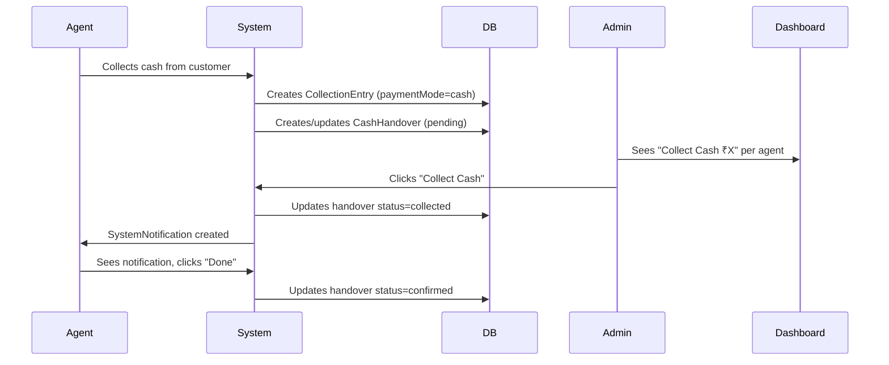

# LoanTrack — 10 Feature Enhancement Plan

## Background

This plan covers 10 new features requested for the LoanTrack micro-lending application. The codebase is a Next.js 16 app using Prisma ORM with MySQL, server actions, and vanilla CSS.

> [!CAUTION]
> **STRICT RULES FOR ALL FEATURES:**
> - **NEVER hardcode values.** All labels, prefixes, thresholds, and configurable values MUST come from `app_settings` table via the existing `getSetting()` / `setSetting()` helper in `lib/tenant.ts`.
> - **NEVER use magic strings inline.** Define constants or read from DB settings.
> - **ALL new DB columns MUST have sensible defaults** so existing data is not broken.
> - **ALL new UI MUST use existing CSS classes** (`card`, `btn`, `form-control`, `modal`, `badge`, `kpi-card`, etc.) from `app/globals.css`. Do NOT invent new class naming conventions.
> - **ALL server actions MUST validate `auth()` session and `tenantId`** before any DB operation.
> - **ALL monetary values MUST use `Decimal(12,2)` in Prisma** and `formatCurrency(value, currencySymbol)` from `lib/utils.ts` in UI.

---

## Feature 1: Frequency-Based Loan ID Prefix

### Goal
Loan codes should reflect the repayment frequency: `DL0001` (daily), `WK0001` (weekly), `BW0001` (biweekly), `ML0001` (monthly).

### Database Changes

#### [MODIFY] [schema.prisma](file:///d:/PROJECTS/WEBSITES/Kandhu/app/prisma/schema.prisma)
Add 4 new `app_settings` rows per tenant (via seed or migration). No schema model changes needed — we already have the `app_settings` key-value table and use `loan_code_prefix` + `loan_code_counter`.

**New settings keys** (group: `general`):

| Key | Default Value | Purpose |
|-----|---------------|---------|
| `loan_prefix_daily` | `DL` | Prefix for daily frequency loans |
| `loan_prefix_weekly` | `WK` | Prefix for weekly frequency loans |
| `loan_prefix_biweekly` | `BW` | Prefix for biweekly frequency loans |
| `loan_prefix_monthly` | `ML` | Prefix for monthly frequency loans |
| `loan_counter_daily` | `0` | Counter for daily loans |
| `loan_counter_weekly` | `0` | Counter for weekly loans |
| `loan_counter_biweekly` | `0` | Counter for biweekly loans |
| `loan_counter_monthly` | `0` | Counter for monthly loans |

### File Changes

#### [MODIFY] [loans/actions.ts](file:///d:/PROJECTS/WEBSITES/Kandhu/app/app/(dashboard)/loans/actions.ts)
**Lines ~128-138** — Replace the single `loan_code_prefix` + `loan_code_counter` logic with frequency-aware logic:

```typescript
// CURRENT (remove):
const prefix = await getSetting(tenantId, 'loan_code_prefix', 'LN');
const counterStr = await getSetting(tenantId, 'loan_code_counter', '0');

// NEW (replace with):
const prefixKey = `loan_prefix_${frequency}`;    // e.g. "loan_prefix_daily"
const counterKey = `loan_counter_${frequency}`;   // e.g. "loan_counter_daily"
const prefix = await getSetting(tenantId, prefixKey, 'LN');
const counterStr = await getSetting(tenantId, counterKey, '0');
const counter = parseInt(counterStr) + 1;
const loanCode = `${prefix}${String(counter).padStart(4, '0')}`;

// Update the frequency-specific counter
await prisma.appSetting.upsert({
  where: { tenantId_key: { tenantId, key: counterKey } },
  update: { value: counter.toString() },
  create: { tenantId, key: counterKey, value: counter.toString(), group: 'general' }
});
```

#### [MODIFY] [prisma/seed.ts](file:///d:/PROJECTS/WEBSITES/Kandhu/app/prisma/seed.ts)
Add the 8 new settings keys with their default values in the seed data array.

#### [MODIFY] [settings/SettingsClient.tsx](file:///d:/PROJECTS/WEBSITES/Kandhu/app/app/(dashboard)/settings/SettingsClient.tsx)
Add a "Loan Code Prefixes" section under the General settings tab. Show 4 text inputs for the prefix values (`loan_prefix_daily`, `loan_prefix_weekly`, `loan_prefix_biweekly`, `loan_prefix_monthly`). Each input reads its value from the existing settings props. Save via the existing `saveSystemSettings` action.

---

## Feature 2: Cash Handover Workflow (Agent → Admin)

### Goal
When an agent collects cash, the admin sees a "Collect Cash" button with the amount. When admin clicks it, the agent gets a notification. Agent confirms by clicking "Done".

### Database Changes

#### [MODIFY] [schema.prisma](file:///d:/PROJECTS/WEBSITES/Kandhu/app/prisma/schema.prisma)
Add a new model:

```prisma
model CashHandover {
  id            String    @id @default(cuid())
  tenantId      String    @map("tenant_id")
  agentId       String    @map("agent_id")
  adminId       String?   @map("admin_id")
  collectionId  String?   @map("collection_id")
  amount        Decimal   @db.Decimal(12, 2)
  status        String    @default("pending")  // pending | collected | confirmed
  requestedAt   DateTime  @default(now()) @map("requested_at")
  collectedAt   DateTime? @map("collected_at")
  confirmedAt   DateTime? @map("confirmed_at")
  remarks       String?   @db.Text
  agent         User      @relation("AgentHandovers", fields: [agentId], references: [id])
  admin         User?     @relation("AdminHandovers", fields: [adminId], references: [id])
  tenant        Tenant    @relation(fields: [tenantId], references: [id], onDelete: Cascade)

  @@index([tenantId, agentId, status])
  @@index([adminId])
  @@map("cash_handovers")
}
```

Add reverse relations to `User` model:
```prisma
agentHandovers  CashHandover[] @relation("AgentHandovers")
adminHandovers  CashHandover[] @relation("AdminHandovers")
```

Add reverse relation to `Tenant` model:
```prisma
cashHandovers  CashHandover[]
```

### File Changes

#### [NEW] `app/(dashboard)/collection/handover-actions.ts`
Server actions:
1. `createCashHandover(formData)` — Agent or system creates a pending handover record when cash collection entries exist. Groups cash-only collection entries for the day.
2. `collectCash(handoverId)` — Admin marks handover as `collected`, sets `collectedAt`, creates a `SystemNotification` for the agent.
3. `confirmHandover(handoverId)` — Agent confirms, sets `confirmedAt`, status → `confirmed`.

#### [MODIFY] [CollectionClient.tsx](file:///d:/PROJECTS/WEBSITES/Kandhu/app/app/(dashboard)/collection/CollectionClient.tsx)
- **Admin view**: Add a "Cash Handover" section above the collection table. Query pending handovers grouped by agent. Show each agent's name, total cash amount, and a "Collect Cash ₹X" button. When clicked, call `collectCash()`.
- **Agent view**: Show a banner/card at top when there's a handover in `collected` status for this agent. Display "Admin collected ₹X — confirm?" with a "Done" button calling `confirmHandover()`.

#### [MODIFY] [dashboard/page.tsx](file:///d:/PROJECTS/WEBSITES/Kandhu/app/app/(dashboard)/dashboard/page.tsx)
Add a "Pending Cash Handovers" card showing agents with uncollected cash. Admin can click "Collect Cash" directly from the dashboard.

### Workflow Summary



---

## Feature 3: Mobile Camera for Agent Onboarding

### Goal
Enable the device camera on mobile for the agent to take photos during customer onboarding (profile photo, KYC docs, guarantor photos).

### File Changes

#### [MODIFY] [CustomerForm.tsx](file:///d:/PROJECTS/WEBSITES/Kandhu/app/app/(dashboard)/customers/new/CustomerForm.tsx)
On **all `<input type="file">` elements** that accept images, add `capture="environment"` attribute. This tells mobile browsers to open the camera directly.

**Specific changes:**
- Line ~144: Profile photo input → add `capture="environment"`
- Line ~225: KYC documents input → add `capture="environment"`
- Line ~276: Guarantor photo input → add `capture="environment"`

```tsx
// BEFORE:
<input type="file" name="profilePhoto" accept="image/*" style={{ display: 'none' }} onChange={handlePhotoChange} />

// AFTER:
<input type="file" name="profilePhoto" accept="image/*" capture="environment" style={{ display: 'none' }} onChange={handlePhotoChange} />
```

#### [MODIFY] [LoanForm.tsx](file:///d:/PROJECTS/WEBSITES/Kandhu/app/app/(dashboard)/loans/new/LoanForm.tsx)
- Line ~596: Cheque image input → add `capture="environment"`
- Line ~695: Guarantor photo input → add `capture="environment"`

> [!NOTE]
> `capture="environment"` uses the rear camera. On desktop browsers this attribute is safely ignored, so no conditional logic needed.

---

## Feature 4: Enhanced Collection Entry Dialog with Overdue Info & Settlement

### Goal
The collection entry modal should show overdue information for the customer/loan, and allow settling overdue instalments directly from the dialog.

### File Changes

#### [MODIFY] [CollectionClient.tsx](file:///d:/PROJECTS/WEBSITES/Kandhu/app/app/(dashboard)/collection/CollectionClient.tsx)

**Enhance the modal (lines ~630-688)** with these additions:

1. **Overdue Summary Section** — Below the customer info card in the modal, add a colored section:
   ```
   ┌─────────────────────────────────────────┐
   │ ⚠️ OVERDUE SUMMARY                      │
   │ 3 missed instalments · 12 days overdue  │
   │ Total Overdue: ₹1,650                   │
   │ Penalty Accrued: ₹600                   │
   └─────────────────────────────────────────┘
   ```

2. **Overdue Instalment List** — Show a scrollable list of all overdue instalments for this loan (not just the one being paid). Each row shows: `#No | Due Date | Due ₹X | Outstanding ₹Y | Days overdue`.

3. **"Settle Overdue" Toggle** — A checkbox/toggle: "Include overdue settlement in this payment". When enabled, the amount field auto-fills with `outstanding + totalOverdueForLoan`. The server action will allocate the payment across multiple instalments (oldest first).

4. **Penalty Display** — Show accrued penalty amount. If admin, show "Waive Penalty" and "Settle Penalty" buttons inline.

**Data requirements**: The modal currently receives a `CollectionRow` which already has `overdueAmount` and `daysOverdue`. We need to also pass **all overdue instalments for the same loan** to the modal. Modify the `openModal` function to filter `overdueInstalments` by `modal.loan.id` and pass them as state.

#### [MODIFY] [collection/actions.ts](file:///d:/PROJECTS/WEBSITES/Kandhu/app/app/(dashboard)/collection/actions.ts)
Modify `submitCollectionEntry` to accept an optional `settleOverdue: boolean` flag. When true, allocate the received amount across all unpaid instalments for the loan (oldest `dueDate` first) instead of just the single instalment.

---

## Feature 5: UPI QR Code Upload in Admin Settings

### Goal
Admin uploads a UPI QR code image in settings. Agents can show it to customers during collection.

### Database Changes
New `app_settings` key: `upi_qr_code_url` (group: `payment`, value: file path string).

### File Changes

#### [MODIFY] [settings/SettingsClient.tsx](file:///d:/PROJECTS/WEBSITES/Kandhu/app/app/(dashboard)/settings/SettingsClient.tsx)
Add a "Payment Settings" tab/section with:
- A file upload area for the UPI QR code image (accepts `image/*`)
- Preview of the currently uploaded QR code
- "Save" button

#### [NEW] `app/(dashboard)/settings/payment-actions.ts`
Server action `saveUpiQrCode(formData)`:
1. Validate admin/superadmin role
2. Save the uploaded image via the existing `saveUploadedFile` helper pattern (save to `private/uploads/{tenantId}/settings/`)
3. Store the resulting file path as `upi_qr_code_url` in `app_settings`

#### [MODIFY] [CollectionClient.tsx](file:///d:/PROJECTS/WEBSITES/Kandhu/app/app/(dashboard)/collection/CollectionClient.tsx)
- Accept `upiQrCodeUrl` as a prop
- In the collection entry modal, when payment mode is `upi`, show a "Show QR to Customer" button
- Clicking it opens a fullscreen overlay displaying the QR code image (optimized for mobile — large, centered, with a close button)

#### [MODIFY] [collection/page.tsx](file:///d:/PROJECTS/WEBSITES/Kandhu/app/app/(dashboard)/collection/page.tsx)
Fetch `upi_qr_code_url` from settings and pass it to `CollectionClient`.

---

## Feature 6: Dashboard — Cash vs UPI Collection Split

### Goal
On the main dashboard, show today's collected amount split into "Cash" and "UPI" separately.

### File Changes

#### [MODIFY] [dashboard/page.tsx](file:///d:/PROJECTS/WEBSITES/Kandhu/app/app/(dashboard)/dashboard/page.tsx)

**In `getDashboardData()` function (~line 42):**

Add a query to get today's collection entries grouped by payment mode:
```typescript
const todayCollectionsByMode = await prisma.collectionEntry.groupBy({
  by: ['paymentMode'],
  where: {
    tenant: { id: tenantId },
    loan: { ...loanWhere },
    submittedAt: { gte: today, lt: tomorrow },
    receivedAmount: { gt: 0 },
  },
  _sum: { receivedAmount: true },
});
```

Parse into `cashCollected` and `upiCollected` values. Return them from the function.

**In the JSX (~line 242-254):**

Replace the single "Adjusted Collected Today" KPI card with two cards:

```
┌──────────────┐  ┌──────────────┐
│ 💵 Cash      │  │ 📱 UPI       │
│ ₹12,500      │  │ ₹8,200       │
│ Collected    │  │ Collected    │
└──────────────┘  └──────────────┘
```

Keep the total collected card as well, but add the breakdown below it or replace it with the two split cards.

---

## Feature 7: Simple Accounting — Profit & Loss

### Goal
Basic double-entry-style accounting to track capital, income (interest earned), expenses, and calculate profit/loss.

### Database Changes

#### [MODIFY] [schema.prisma](file:///d:/PROJECTS/WEBSITES/Kandhu/app/prisma/schema.prisma)

```prisma
model AccountEntry {
  id          String   @id @default(cuid())
  tenantId    String   @map("tenant_id")
  branchId    String?  @map("branch_id")
  date        DateTime @db.Date
  type        String   // "capital_in" | "capital_out" | "loan_disbursement" | "collection" | "expense" | "penalty_income"
  category    String?  // user-defined: "salary", "rent", "travel", etc.
  amount      Decimal  @db.Decimal(14, 2)
  description String?  @db.Text
  referenceId String?  @map("reference_id")  // links to loan.id, collectionEntry.id, etc.
  createdById String?  @map("created_by_id")
  createdAt   DateTime @default(now()) @map("created_at")
  tenant      Tenant   @relation(fields: [tenantId], references: [id], onDelete: Cascade)
  branch      Branch?  @relation(fields: [branchId], references: [id])
  createdBy   User?    @relation(fields: [createdById], references: [id])

  @@index([tenantId, type, date])
  @@index([branchId])
  @@map("account_entries")
}
```

Add reverse relations to `Tenant`, `Branch`, `User` models.

### New Settings Keys
| Key | Default | Purpose |
|-----|---------|---------|
| `initial_capital` | `0` | Starting capital amount |
| `expense_categories` | `["salary","rent","travel","office","other"]` | JSON array of categories |

### File Changes

#### [NEW] `app/(dashboard)/accounting/page.tsx`
Server component page:
- Fetch all `AccountEntry` records for the tenant, grouped by type and month
- Calculate: **Capital** = `capital_in - capital_out - loan_disbursements + collections`
- Calculate: **Revenue** = total interest earned (sum of `deduction` from all loans created in period) + penalty income
- Calculate: **Expenses** = sum of all `expense` type entries
- Calculate: **Profit/Loss** = Revenue - Expenses
- Render the `AccountingClient` component

#### [NEW] `app/(dashboard)/accounting/AccountingClient.tsx`
Client component with:
- **Summary cards**: Current Capital, Total Revenue, Total Expenses, Net Profit/Loss
- **Date range filter** (month picker)
- **Transactions table**: Date, Type, Category, Description, Amount (+/-), Reference
- **Add Expense button** → modal with: date, category (dropdown from settings), amount, description
- **Add Capital button** → modal for capital injection/withdrawal

#### [NEW] `app/(dashboard)/accounting/actions.ts`
Server actions:
1. `addExpense(formData)` — Creates an `AccountEntry` with type `expense`
2. `addCapital(formData)` — Creates an `AccountEntry` with type `capital_in` or `capital_out`
3. `getAccountingSummary(startDate, endDate)` — Aggregates entries by type

#### [MODIFY] [loans/actions.ts](file:///d:/PROJECTS/WEBSITES/Kandhu/app/app/(dashboard)/loans/actions.ts)
After creating a loan (~line 314), auto-create an `AccountEntry`:
```typescript
await prisma.accountEntry.create({
  data: {
    tenantId,
    branchId: activeBranchId,
    date: startDate,
    type: 'loan_disbursement',
    amount: disbursed,
    description: `Loan ${loanCode} disbursed to ${customer.name}`,
    referenceId: loan.id,
    createdById,
  }
});
```

#### [MODIFY] [collection/actions.ts](file:///d:/PROJECTS/WEBSITES/Kandhu/app/app/(dashboard)/collection/actions.ts)
After creating a collection entry, auto-create an `AccountEntry`:
```typescript
await prisma.accountEntry.create({
  data: {
    tenantId,
    branchId,
    date: new Date(),
    type: 'collection',
    amount: receivedAmount,
    description: `Collection from ${customerName} for ${loanCode}`,
    referenceId: collectionEntry.id,
    createdById: agentId,
  }
});
```

#### [MODIFY] Sidebar/layout
Add "Accounting" link in the sidebar navigation (admin/superadmin only). Use icon `account_balance`.

---

## Feature 8: Route-wise Collected Amount by Agent

### Goal
Show a breakdown of collections per route per agent, so admin can see which agent collected how much on which route.

### File Changes

#### [MODIFY] [dashboard/page.tsx](file:///d:/PROJECTS/WEBSITES/Kandhu/app/app/(dashboard)/dashboard/page.tsx)

**In `getDashboardData()`**, add a query:
```typescript
const routeCollections = await prisma.dailyCollection.findMany({
  where: {
    tenantId,
    appType,
    date: { gte: today, lt: tomorrow },
    ...(branchId ? { branchId } : {}),
  },
  include: {
    agent: { select: { id: true, name: true } },
    route: { select: { id: true, name: true } },
  },
});
```

**In the JSX**, enhance the existing "Route Health" table (lines ~308-334) to add a `Collected Today` column:

| Route | Agent | Customers | Collected Today | Overdue |
|-------|-------|-----------|----------------|---------|
| Erode Main | Ravi | 15 | ₹4,500 | ₹1,200 |

Also add a `paymentMode` breakdown per route if data is available (query `collectionEntries` grouped by `paymentMode` for each route).

---

## Feature 9: Capital Reduction on Loan Creation

### Goal
When a loan is created, the capital (tracked in accounting) should automatically reduce by the disbursed amount. This is already handled by Feature 7's auto-creation of `AccountEntry` with type `loan_disbursement` inside `createLoan()`.

### Additional Integration

#### [MODIFY] [dashboard/page.tsx](file:///d:/PROJECTS/WEBSITES/Kandhu/app/app/(dashboard)/dashboard/page.tsx)
Add a "Current Capital" KPI card on the dashboard. Calculate it as:
```typescript
const capitalEntries = await prisma.accountEntry.aggregate({
  where: { tenantId, type: { in: ['capital_in'] } },
  _sum: { amount: true },
});
const disbursements = await prisma.accountEntry.aggregate({
  where: { tenantId, type: 'loan_disbursement' },
  _sum: { amount: true },
});
const collections = await prisma.accountEntry.aggregate({
  where: { tenantId, type: 'collection' },
  _sum: { amount: true },
});
const expenses = await prisma.accountEntry.aggregate({
  where: { tenantId, type: 'expense' },
  _sum: { amount: true },
});
const currentCapital =
  Number(capitalEntries._sum.amount || 0)
  - Number(disbursements._sum.amount || 0)
  + Number(collections._sum.amount || 0)
  - Number(expenses._sum.amount || 0);
```

Display as a KPI card with icon `savings`.

---

## Feature 10: Due Day/Date in Loan Creation

### Goal
Add a "Due Day" or "Due Date" field in the loan creation form. For daily loans this is automatic (every day). For weekly, the user picks the day of week (Mon-Sun). For monthly, the user picks the day of month (1-28). For biweekly, the user picks the day of week.

### Database Changes

#### [MODIFY] [schema.prisma](file:///d:/PROJECTS/WEBSITES/Kandhu/app/prisma/schema.prisma)
Add to `Loan` model:
```prisma
dueDay  Int? @map("due_day")  // 0-6 for day-of-week (weekly/biweekly), 1-28 for day-of-month (monthly)
```

### File Changes

#### [MODIFY] [LoanForm.tsx](file:///d:/PROJECTS/WEBSITES/Kandhu/app/app/(dashboard)/loans/new/LoanForm.tsx)

After the frequency dropdown (~line 543), add a conditional "Due Day" field:

```tsx
{frequency === 'weekly' || frequency === 'biweekly' ? (
  <div className="form-group">
    <label className="form-label">Due Day *</label>
    <select name="dueDay" className="form-control" value={dueDay} onChange={e => setDueDay(Number(e.target.value))} required>
      <option value="">Select Day</option>
      {['Sunday','Monday','Tuesday','Wednesday','Thursday','Friday','Saturday']
        .map((day, i) => <option key={i} value={i}>{day}</option>)}
    </select>
  </div>
) : frequency === 'monthly' ? (
  <div className="form-group">
    <label className="form-label">Due Date (Day of Month) *</label>
    <select name="dueDay" className="form-control" value={dueDay} onChange={e => setDueDay(Number(e.target.value))} required>
      <option value="">Select Date</option>
      {Array.from({ length: 28 }, (_, i) => i + 1)
        .map(d => <option key={d} value={d}>{d}</option>)}
    </select>
  </div>
) : null}
```

#### [MODIFY] [loans/actions.ts](file:///d:/PROJECTS/WEBSITES/Kandhu/app/app/(dashboard)/loans/actions.ts)
1. Read `dueDay` from formData: `const dueDay = formData.get('dueDay') ? Number(formData.get('dueDay')) : null;`
2. Pass `dueDay` to the `calculateInstalmentDates()` function
3. Store `dueDay` on the loan record

#### [MODIFY] [lib/utils.ts](file:///d:/PROJECTS/WEBSITES/Kandhu/app/lib/utils.ts)
Modify `calculateInstalmentDates(startDate, frequency, tenure, dueDay?)` to honor the `dueDay` parameter:
- **weekly/biweekly**: If `dueDay` is provided (0-6), find the next occurrence of that day of week from `startDate`, then increment by 7 or 14 days for each subsequent instalment.
- **monthly**: If `dueDay` is provided (1-28), set the instalment dates to that day of each month starting from the start month.
- **daily**: Ignore `dueDay` — every day is a due date.

#### [MODIFY] [loans/[id]/edit/page.tsx](file:///d:/PROJECTS/WEBSITES/Kandhu/app/app/(dashboard)/loans/[id]/edit/page.tsx)
Add the same due day field in the edit form, pre-populated from `loan.dueDay`.

---

## Feature 11: Adjusted/Distributed View Toggle for Loan Schedule and Heatmap

### Goal
The current system records payments against specific instalments. If a customer pays extra on a later day to cover past missed days, older instalments might still appear as "missed" in the literal timeline view. The user wants to **preserve this exact literal workflow in the backend**, but add a toggle button in the Loan Detail page to visually switch between the "Actual Settlements" (how payments were literally recorded) and an "Adjusted/Distributed View" (where the total paid amount is visually distributed sequentially across instalments from the start date, clearing out older dues visually). This toggle must affect both the Payment Schedule list and the Calendar Heatmap.

### File Changes

#### [MODIFY] `app/(dashboard)/loans/[id]/LoanDetailClient.tsx`
- Add a new state variable: `const [isAdjustedView, setIsAdjustedView] = useState(false);`
- Add a UI toggle switch or button group near the Payment Schedule and Calendar Heatmap sections (e.g., "View: Actual Settlements | Distributed Adjustments").
- **Payment Schedule Logic**:
  - If `!isAdjustedView`, render the schedule exactly as it is now.
  - If `isAdjustedView`, create a derived schedule array: Take the total collected amount for the loan. Iterate through the chronological instalments. Fill the first instalment's `dueAmount` using the total collected. If fully filled, mark as `Paid` (visually). Subtract that amount from the total collected and move to the next instalment. If partially filled, mark as `Partial`. If total collected runs out, mark subsequent past dates as `Missed` and future dates as `Upcoming`.
- **Calendar Heatmap Logic**:
  - Apply the exact same visual redistribution logic to the data fed into the Calendar Heatmap component. If `isAdjustedView` is true, the heatmap cells should light up green sequentially from the start date up to the total paid amount, ignoring the actual payment dates.

---

## Verification Plan

### Automated Tests
1. Run `npx prisma db push` to verify schema changes apply cleanly
2. Run `npx tsc --noEmit` to verify zero TypeScript errors
3. Run `npm run build` to verify the production build succeeds

### Manual Verification
1. **Feature 1**: Create loans with different frequencies, verify loan codes use correct prefixes
2. **Feature 2**: Agent collects cash → admin sees collect button → agent sees confirmation
3. **Feature 3**: Open customer form on mobile → camera should launch for photo inputs
4. **Feature 4**: Open collection entry dialog → verify overdue info displayed, settle overdue toggle works
5. **Feature 5**: Upload QR in settings → verify it appears in collection dialog when UPI mode selected
6. **Feature 6**: Dashboard shows Cash vs UPI split correctly
7. **Feature 7**: Create expense, create loan → verify accounting page shows correct P&L
8. **Feature 8**: Route health table shows collected amount per route per agent
9. **Feature 9**: Create loan → verify capital KPI decreases by disbursed amount
10. **Feature 10**: Select weekly frequency → due day dropdown appears → instalments generated on correct days
11. **Feature 11**: Open loan details → toggle "Adjusted View" → verify payment schedule and heatmap are distributed sequentially based on total collected amount

---

## Implementation Order (Recommended)

| Phase | Features | Rationale |
|-------|----------|-----------|
| 1 | 1, 3, 10 | Small, isolated changes. No new tables. |
| 2 | 7, 9 | Accounting foundation needed before Features 2, 6, 8 |
| 3 | 5, 6, 8 | Settings + dashboard enhancements |
| 4 | 4, 2, 11 | Collection dialog + handover workflow (most complex) |
